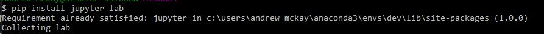
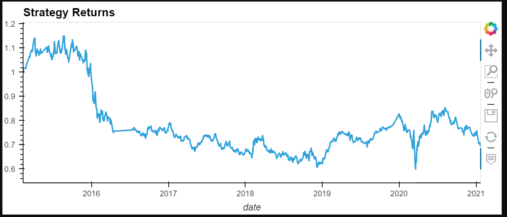
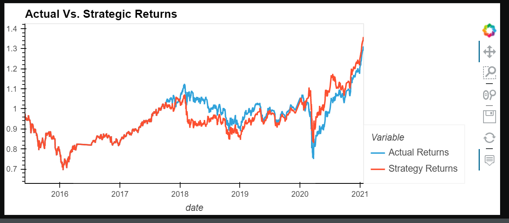
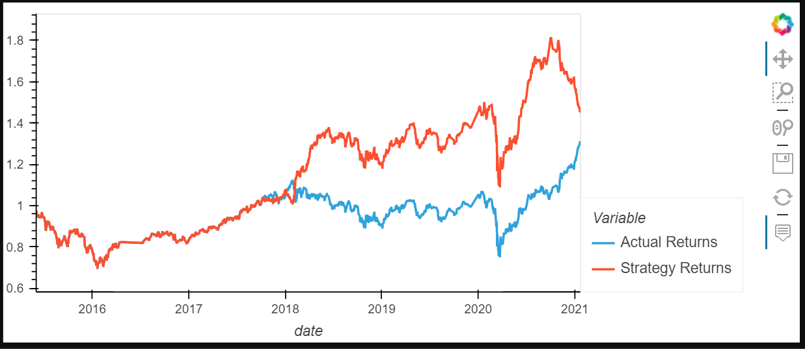

# Module_14_Challenge: Machine Learning Trading Bot

This application uses SKLearn to hone a machine learning model to figure out which will yeild the best returns with SMA(Simple Moving Averages).

---

## Technologies

This was run on a pc using Windows 10

This project leverages python 3.8.11 with the following packages:

* [pandas](https://pandas.pydata.org/docs) - For manipulating the DataFrame.

* [Jupyter Lab](https://jupyterlab.readthedocs.io.en/stable) - For code and visualizations.

* [numpy](https://numpy.org/install/) - For scientific computing with python.

* [pathlib](https://docs.python.org/3/library/pathlib.html) - For location through the directory and file path.

* [hvplot](https://hvplot.holoviz.org/user_guide/Introduction.html) - For creating the visualization of our data from the DataFrame.

* [matplotlib](https://matplotlib.org/) - Used to create static, animate, and interactive visualizations in Python.

* [Standardscaler](https://scikit-learn.org/stable/modules/generated/sklearn.preprocessing.StandardScaler.html) - For standardizing features by removing the mean and scaling to unit variance.

* [OneHotEncoder](https://scikit-learn.org/stable/modules/generated/sklearn.preprocessing.OneHotEncoder.html) - For encoding categorical features as a one-hot numeric array.

---

## Installation Guide

In gitbash after you have activated your dev environment, install the following:

*Jupyter Lab

    `pip install jupyter lab`
    

*Tensorflow

    `pip install --upgrade tensorflow`
    

---

## Examples

The images below show the different types of dataframes and outputs that should be a result from running the code in the MachineLearning Trading Bot application.

## C

---

## Contributors

Andrew McKay

Email: andrew.v.mckay@gmail.com

---